# splunk-home-lab

🟢 Overview

This is my personal Splunk lab where I:

Installed Splunk Enterprise locally

Set up a forwarder

Collected logs from my own machine

Searched and visualized them

🧰 Lab Setup
System

OS: Kali/Ubuntu 

Splunk Enterprise version

Splunk Universal Forwarder version

Network

All components run locally

Indexer listening on 9997

Web UI on 8000

ASCII diagram so they don’t guess:

[Device Logs] --> [Universal Forwarder] --> [Splunk Enterprise]
                                      --> (index=main)
                                      --> Web UI: http://localhost:8000

🔧 Installation

1. Download splunk tar file from splunk link from this : [Link](https://www.splunk.com/en_us/download.html)
   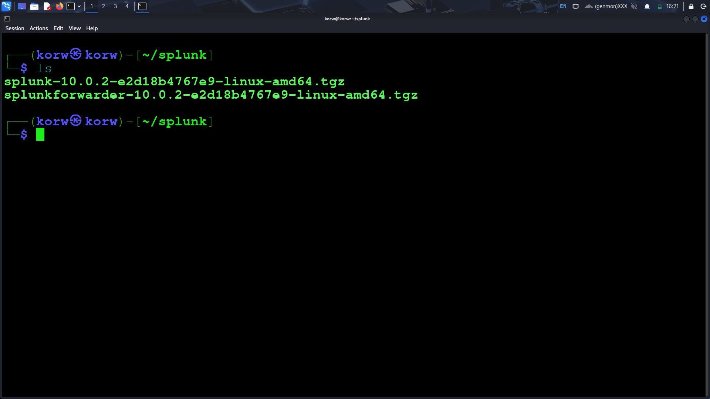

2. extract the tar file
   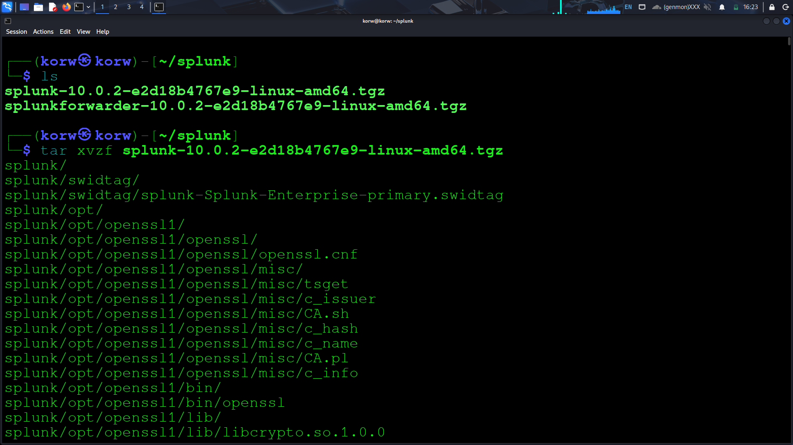

3. Check if that is sucessfully extracted or not. verify it by using ls cmd and mv the splunk to /opt/ directory
   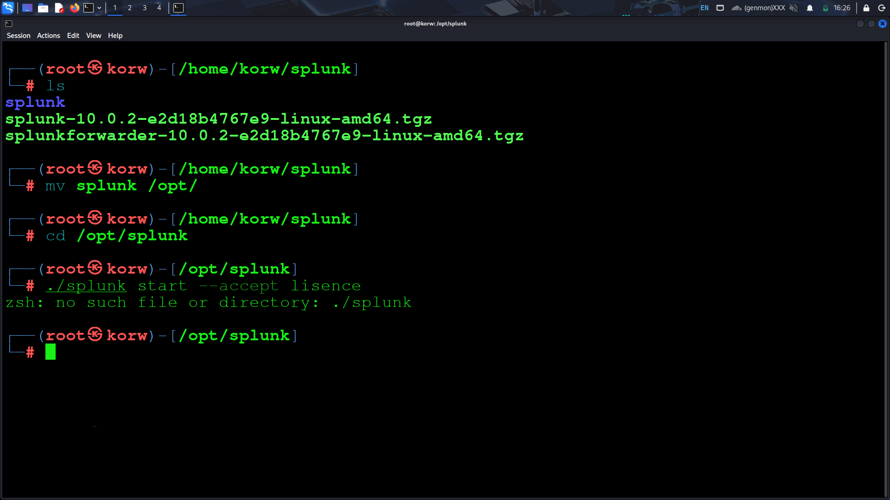

4.now navigate to /opt/splunk/bin and follow this cmd to accept the lisence

You can perform other cmd like:

./bin/splunk stop
./bin/splunk restart
./bin/splunk status
./bin/splunk add oneshot
./bin/splunk search coffely
./bin/splunk help

Now open the link for splunk dashboard

5. Now they will ask for username and password
   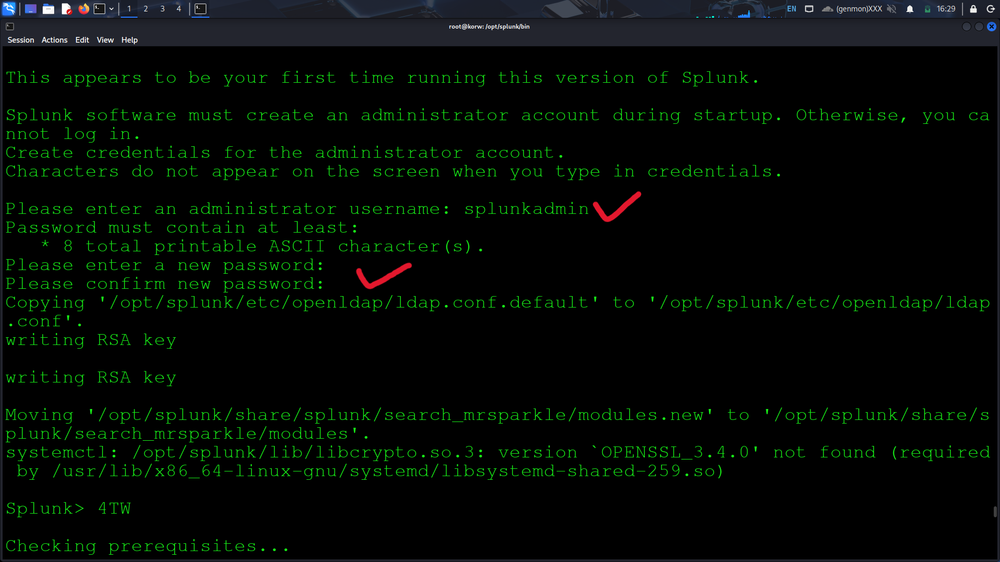

   Now we sucessfully setup the splunk enterprise

NOTE: 
There are two splunk forwarder:

1. heavy forwarder : used when we need to apply a filter, analyse or make change to the log at the source before forwarding it to the destination.
2. Universal forwarder : leightweight agent that get installed on the target host. main purpose is to get the logs and send them to splunk instance on another forwarder without applying any filter on indexing.

#setup universal forwarder

1. Download the splunk forwarder
   

2. Extract the splunk forwarder
   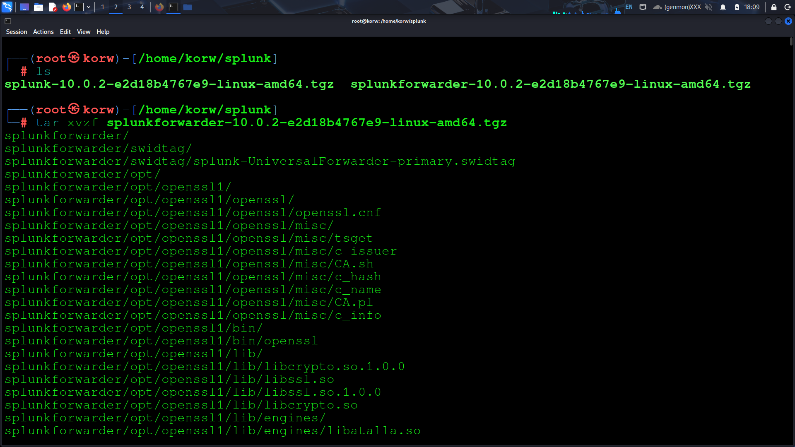
   
3. mv the splunk forwarder to /opt/ directory
   

4.change directory to /opt/splunkforwarder and accept teh lisence
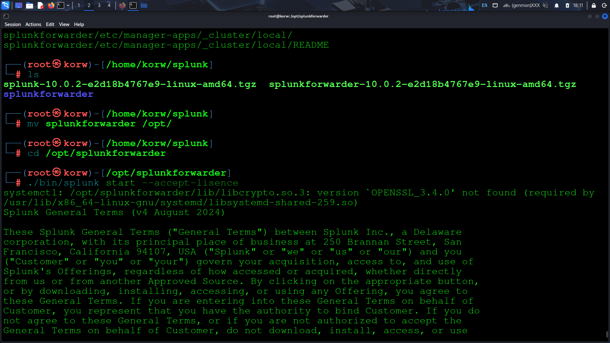

if they asking to change port: 8090 
#8089 is default port on which splunk forwarder run 

Now we have sucessfully installed splunk forwarder 

#Configure teh forwarder

1.Login in splunk and go to setting then forwarder and reciever tab

2. CLick configure recieving and then neww recieving port

   By default, the splunk instance revieve data from forwarder on the port 9997
   Now listening port is enabled

   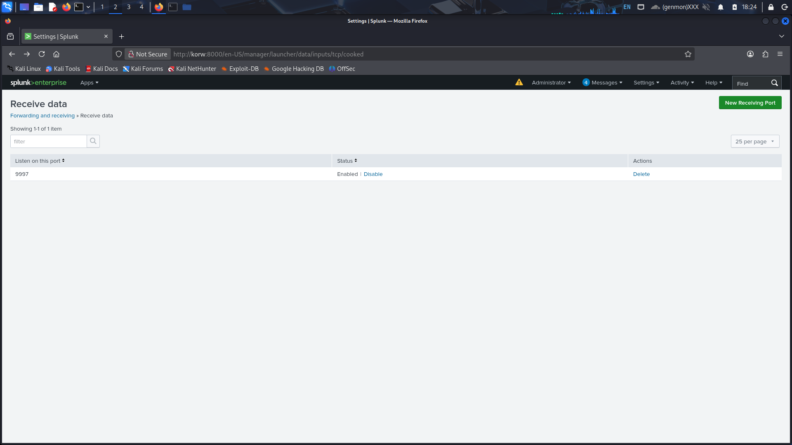

3. go to indexes and click on new index
   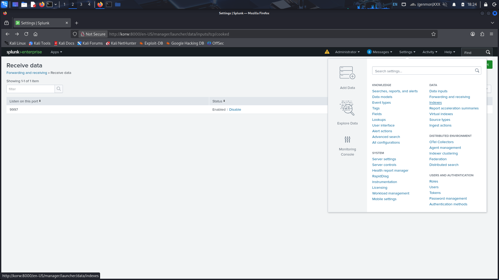
   fill an index name and save it
   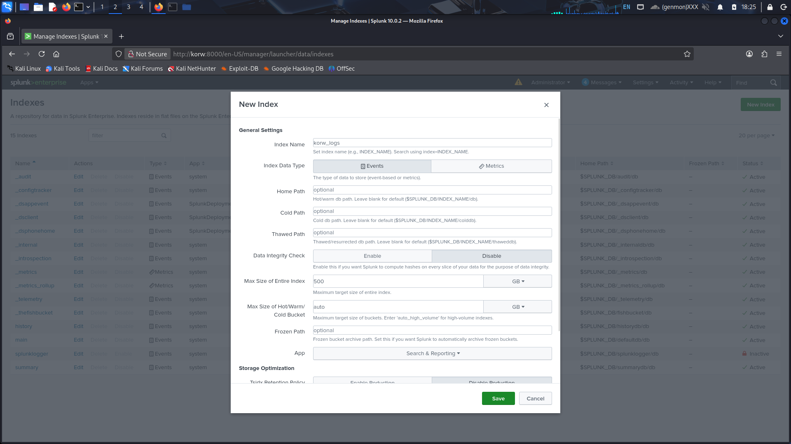

NOW BACK TO LINUX HOST TERMINAL

4. Navigate to /opt/splunkforwarder/bin and execute the following cmd
    ./splunk add forwarder-server 127.0.0.1:9997

   adn verify it
   

5. Now we will tell splunk forwarder which log file to monitor
   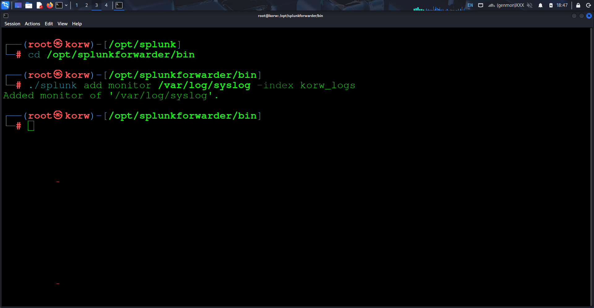

   WE CAN ADD OTHER LOG IN THIS SAME WAY

6. open input.conf file located in /opt/splunk/forwarder/etc/apps/search/local
   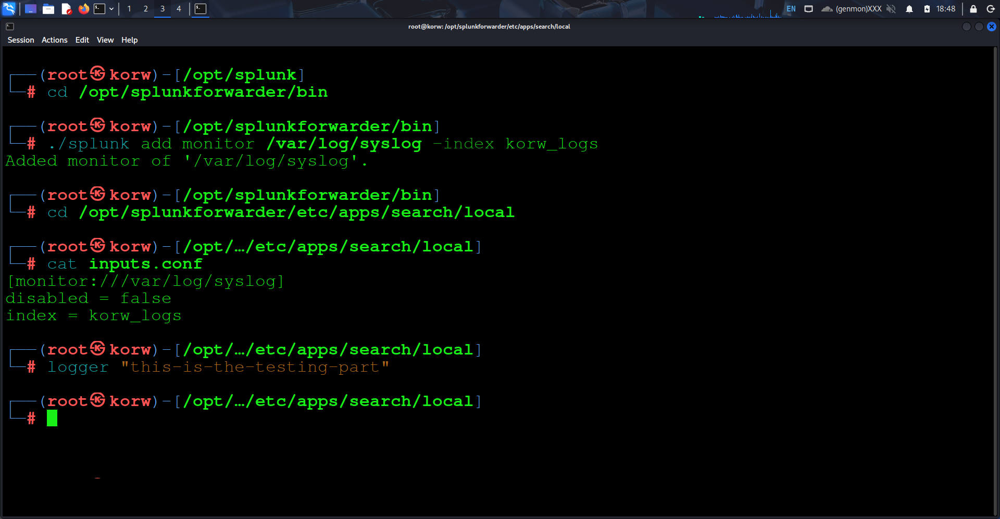

#NOW WE WILL TEST 

we will user the logger cmd for this test
logger "this-is-test-cmd"
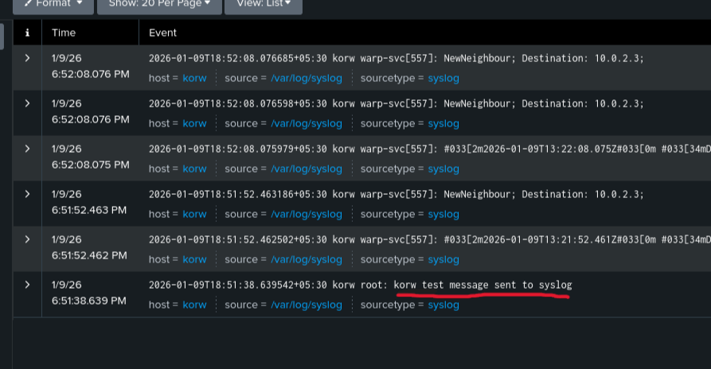

🏁 Conclusion

This lab helped me see the full path of logs — from my system, through the forwarder, into Splunk, and finally into searches.
Now I understand how a SIEM actually collects and shows data, not just the theory.
This is my starting point — I’ll add more log sources, alerts, and maybe a second machine next.  
