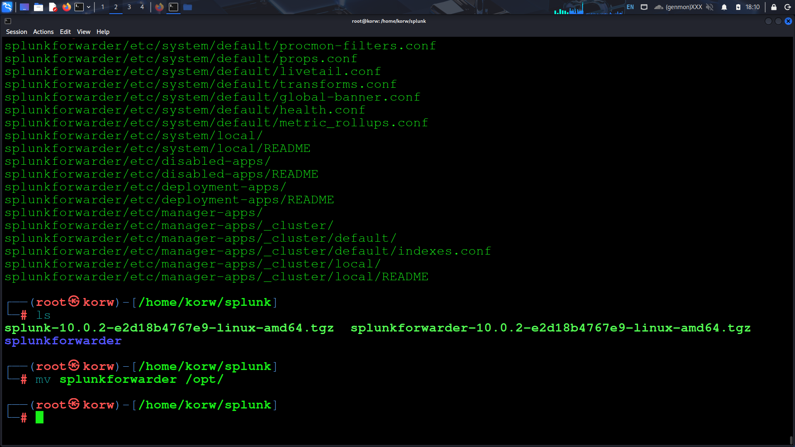

# splunk-home-lab

🟢 Overview

This is my personal Splunk lab where I:

Installed Splunk Enterprise locally

Set up a forwarder

Collected logs from my own machine

Searched and visualized them

🧰 Lab Setup
System

OS: Kali/Ubuntu 

Splunk Enterprise version

Splunk Universal Forwarder version

Network

All components run locally

Indexer listening on 9997

Web UI on 8000

ASCII diagram so they don’t guess:

[Device Logs] --> [Universal Forwarder] --> [Splunk Enterprise]
                                      --> (index=main)
                                      --> Web UI: http://localhost:8000

🔧 Installation

1. Download splunk tar file from splunk link from this : [Link](https://www.splunk.com/en_us/download.html)
   

2. extract the tar file
   

3. Check if that is sucessfully extracted or not. verify it by using ls cmd and mv the splunk to /opt/ directory
   

4.now navigate to /opt/splunk/bin and follow this cmd to accept the lisence

You can perform other cmd like:

./bin/splunk stop
./bin/splunk restart
./bin/splunk status
./bin/splunk add oneshot
./bin/splunk search coffely
./bin/splunk help

Now open the link for splunk dashboard

5. Now they will ask for username and password
   

   Now we sucessfully setup the splunk enterprise

NOTE: 
There are two splunk forwarder:

1. heavy forwarder : used when we need to apply a filter, analyse or make change to the log at the source before forwarding it to the destination.
2. Universal forwarder : leightweight agent that get installed on the target host. main purpose is to get the logs and send them to splunk instance on another forwarder without applying any filter on indexing.

#setup universal forwarder

1. Download the splunk forwarder
   

2. Extract the splunk forwarder
   
   
3. mv the splunk forwarder to /opt/ directory
   
