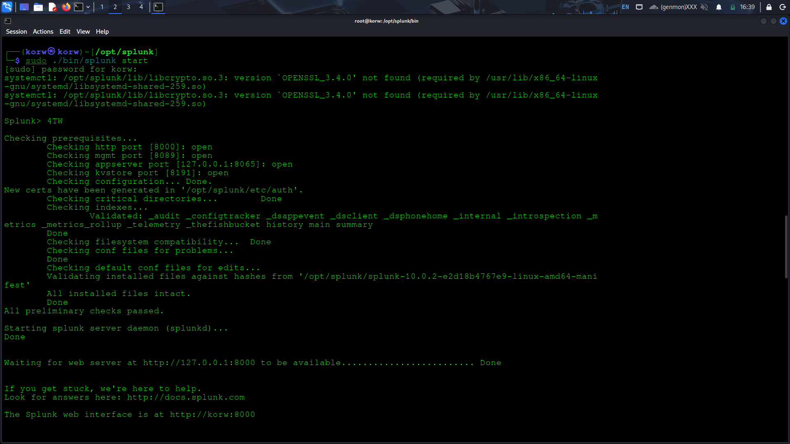

# splunk-home-lab

🟢 Overview

This is my personal Splunk lab where I:

Installed Splunk Enterprise locally

Set up a forwarder

Collected logs from my own machine

Searched and visualized them

🧰 Lab Setup
System

OS: Kali/Ubuntu 

Splunk Enterprise version

Splunk Universal Forwarder version

Network

All components run locally

Indexer listening on 9997

Web UI on 8000

ASCII diagram so they don’t guess:

[Device Logs] --> [Universal Forwarder] --> [Splunk Enterprise]
                                      --> (index=main)
                                      --> Web UI: http://localhost:8000

🔧 Installation

1. Download splunk tar file from splunk link from this : [Link](https://www.splunk.com/en_us/download.html)
   

2. extract the tar file
   

3. Check if that is sucessfully extracted or not. verify it by using ls cmd and mv the splunk to /opt/ directory
   

4.now navigate to /opt/splunk/bin and follow this cmd to accept the lisence

5. Now they will ask for username and password
   

6. Now navigate to /opt/splunk and execute the follow cmd to start the splunk
   
